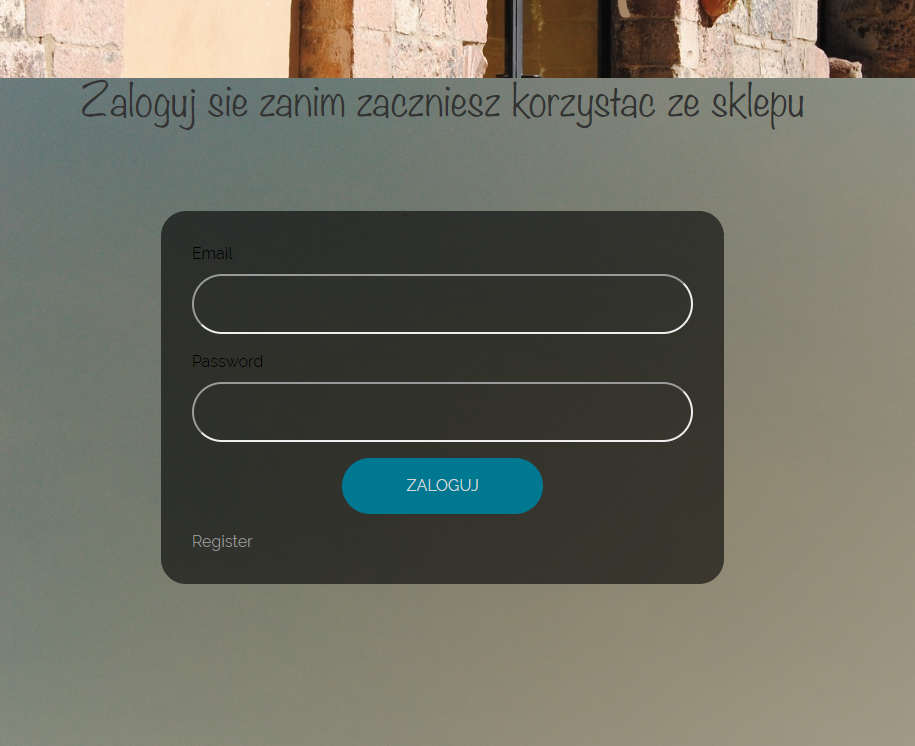
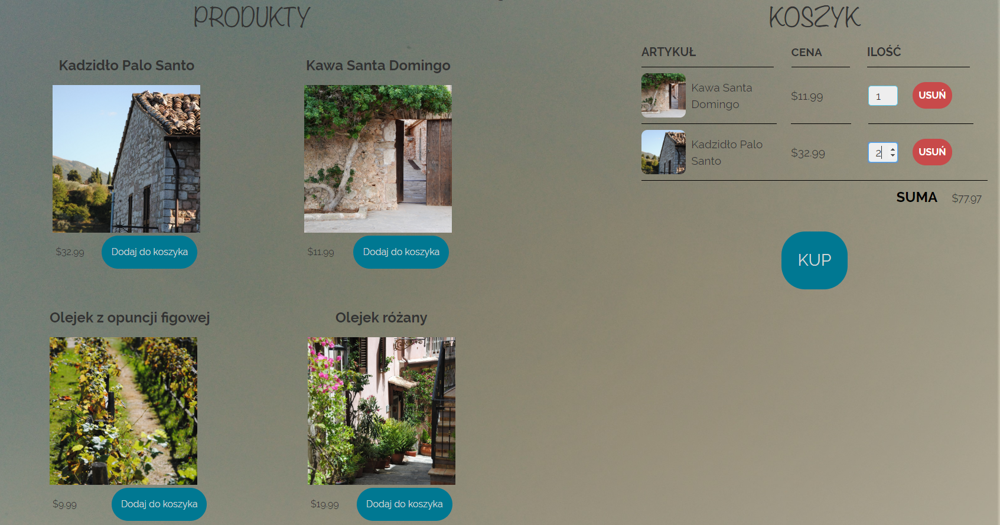

# The Shop documentation
Content: 
1) Launching
2) The way app works
3) App explained
4) Things to change
 
 ## Launching
 This is the first version of node.js application.
 To run application node.js and npm package needs to be installed first on the computer.
 
 ___
After downloading all the files from my repository you need install bcrypt and nodemon on your own.  

    npm install express
    npm install ejs
    npm install bcrypt 
    npm run devStart
    (if error permission denied occured you need npm rebuild and try again) 
In the addition, to make bcrypt work you need to create a real account on bcrypt webpage. Thanks to that, 
you get your own public and secret key and put them into file '.env'

    SESSION_SECRET = secret
    STRIPE_SECRET_KEY=sk_test_[some numbers and letters goes here]
    STRIPE_PUBLIC_KEY=pk_test_[some numbers and letters goes here]
    
To run application you need to run in console: 

    npm run devStart
    
And open in the browser: 

    http://localhost:3000/
##  The way app works

Without an account the user does not have a permission to see store site. First it is needed to create 
an account (register), next it is obligated to login and finally the store site is available.

In the store the user can purchase (not really) products, make a payment and each payment will be registered 
on a special webpage only admin can reach.
If payments do not succeed perhaps you need to create an account on a stripe site and download public and secret 
keys and put them into file '.env'
 
    SESSION_SECRET = secret
    STRIPE_SECRET_KEY=sk_test_[some numbers and letters goes here]
    STRIPE_PUBLIC_KEY=pk_test_[some numbers and letters goes here]
 
 

#### Fast use
Password extension: email must contain @ 
 
Stripe extension: use special card numbers: 

Card number: 42 4242 4242 4242 4242 4242

validation number: 123

exp date: some date from the future

##  App explained
Main dependencies are: 
* express 
*  ejs
* nodemon
* dotenv
* passport
* bcrypt
* stripe

All of them need to be declared through package.json. 
Passport / bcrypt is a library which cipher passwords and keep login / register safe.
Stripe deals with transfers and payments used in the app. All necessary html, css and js files are in public
folder. 

### Things that needs to be changes

* Bootstrap Menu
* Making proper photos to products.
* CSS refactoring

